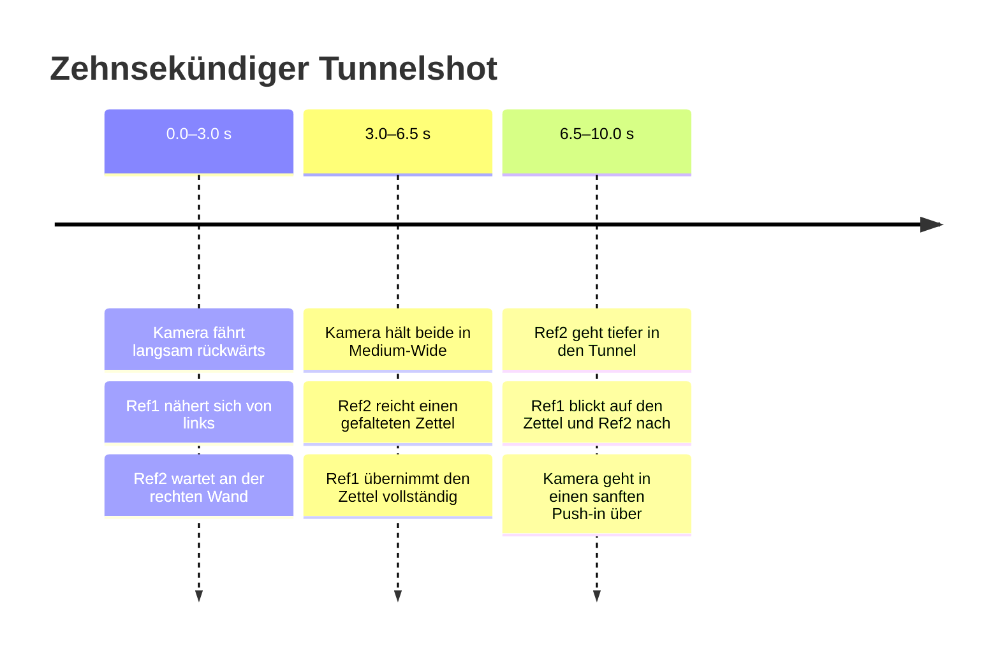

# MiniMax H3: Prompting, Referenzsteuerung und zeitliche Sub-Clip-Regie

## Executive Summary

Die Recherche bestätigt die Grundidee: **Eine strukturierte Shot-Timeline mit Unterspuren für Kamera, Figuren, Referenzen und Aktionen lässt sich sinnvoll durch ein LLM in einen H3-Prompt kompilieren.** MiniMax selbst beschreibt mit **H3-Context-IR** sogar genau eine solche Zwischenschicht: Freie multimodale Eingaben werden analysiert, zeitlich strukturiert und in eine für H3 besser verständliche Repräsentation überführt. In der offenen Veröffentlichung ist dieser gehostete Context-IR-Teil jedoch nicht vollständig enthalten, weshalb ein eigener Timeline-zu-Prompt-Compiler technisch sehr gut in die vorgesehene Architektur passt. citeturn6view0turn6view4

Die beiden priorisierten Guides stimmen in ihren wichtigsten Empfehlungen überein:

- Jede Referenz erhält **eine explizite Aufgabe**.
- Ein Video wird als Folge zeitlich markierter **Beats** beschrieben, nicht als statisches Bild.
- Kamera, Handlung, Look, Ton und Einschränkungen werden getrennt formuliert.
- Negative Anweisungen funktionieren besser, wenn sie kurz und konkret auf wahrscheinliche Fehler zielen.
- Referenzen sollten über den gesamten Produktionsprozess in derselben Reihenfolge und Bedeutung wiederverwendet werden. citeturn3view3turn3view2turn6view1

Die neu veröffentlichten offiziellen MiniMax-Guides gehen deutlich weiter als fal und Morphic. Für den Referenzmodus definieren sie sechs Abschnitte – `subject_definitions`, `summary`, `retention_analysis`, `detailed_description`, `overall_soundscape` und `non_diegetic_music` – sowie stabile Marker wie `<Subject 1>`, `<Picture 1>`, `<Video 1>` und `<Audio 1>`. Für Schnitte ist sogar eine Form wie `[Shot 2] At 00:03.500` vorgesehen. citeturn8view1turn9view2turn9view3

**Die zeitliche Präzision darf dennoch nicht mit einem klassischen Animationssystem verwechselt werden.** H3 kann Millisekundenangaben lesen, aber es gibt bislang keine belastbare öffentliche Evidenz, dass komplexe Aktionen framegenau zu solchen Zeitpunkten stattfinden. Die offiziellen und kommerziellen Beispiele arbeiten überwiegend mit semantischen Abschnitten von zwei bis fünf Sekunden; ein ausgewähltes fal-Beispiel verwendet auch 1,5-Sekunden-Blöcke, allerdings für UI- und Übergangsaktionen, nicht für eine anspruchsvolle Zwei-Personen-Objektübergabe. citeturn3view5turn3view1turn8view0

Für einen zehnsekündigen Shot mit zwei Figuren, einer Location und einer Objektübergabe lautet die praktische Empfehlung:

> **Drei große Regiebeats von ungefähr drei bis dreieinhalb Sekunden verwenden.**  
> Einsekündige Ereignisse dürfen innerhalb dieser Beats beschrieben werden.  
> Halbsekündige Sub-Clips sollten lediglich als weiche Cue-Marker dienen, nicht als selbständige, zuverlässig ausführbare Aktionen.

Die Benutzeroberfläche darf weiterhin mit 0,5-Sekunden-Auflösung arbeiten. Der Compiler sollte solche Mikrosequenzen jedoch zu größeren **semantischen Beats** zusammenfassen.

## Quellenlage und aktueller Spezifikationsstand

MiniMax veröffentlichte H3 am 31. Juli 2026 als allgemeines multimodales Generationsmodell. Es verarbeitet Text, Bilder, Video und Audio gemeinsam und erzeugt Videos mit nativem Stereoton. Reuters bestätigt eine maximale Länge von 15 Sekunden und eine Ausgabe bis 2K; die inzwischen veröffentlichte Modellkarte nennt zusätzlich 24 Bilder pro Sekunde und 32-kHz-Stereoton. citeturn1view2turn1view5turn6view0

Die aktuelle offizielle API-Dokumentation ist bei der Mindestdauer maßgeblich: Sie akzeptiert **ganze Sekunden von 4 bis 15**. fal beschreibt seine gehosteten Endpunkte dagegen mit **5 bis 15 Sekunden**. Dies ist keine Modellgrenze, sondern offenbar eine Abweichung zwischen Anbieter-Wrapper und direkter MiniMax-API. Für eine eigene Anwendung sollte der jeweilige Endpoint zur Laufzeit validiert werden. citeturn1view3turn4view0turn3view4

Im Referenzmodus gelten derzeit folgende dokumentierte Grenzen:

| Eingabetyp | Offizielle Grenze |
|---|---:|
| Referenzbilder | bis zu 9 |
| Referenzvideos | bis zu 3, jeweils 2–15 Sekunden, zusammen höchstens 15 Sekunden |
| Referenzaudio | bis zu 3, jeweils 2–15 Sekunden, zusammen höchstens 15 Sekunden |
| Gemischte Dateien | höchstens 12 insgesamt |
| Prompt | höchstens 7.000 Zeichen |
| Ausgabe | 4–15 Sekunden, ganzzahlig |
| Bildrate | 24 fps |
| Auflösung | 768P oder 2K über den vollständigen Workflow |

Audio darf im Referenzmodus nicht allein verwendet werden; mindestens ein Bild oder Video muss mitgegeben werden. citeturn1view3turn4view0turn6view0

Die direkte API verwendet keine sichtbaren `@ref1`-Tokens. Medien werden als Einträge im `content`-Array mit Rollen wie `reference_image`, `reference_video` oder `reference_audio` übergeben. Die semantische Aufgabe – Hauptfigur, Nebenfigur, Location, Kamera oder Bewegung – muss weiterhin im Text beschrieben werden. citeturn4view0turn4view1

Damit existieren drei unterschiedliche Ebenen von Referenzsyntax:

| Ebene | Syntax | Bedeutung |
|---|---|---|
| Anwendung beziehungsweise Timeline | `ref1`, `ref2`, `location` | Eigene stabile IDs |
| Anbieter-Prompt | `Image 1`, `Video 1`, `Audio 1`, gelegentlich `@Image 1` | Position des Assets im Upload |
| Offizielle H3-IR | `<Subject 1>`, `<Picture 1>`, `<Video 1>`, `<Audio 1>` | Semantische und strukturelle Labels |

fal verwendet in seinen Beispielen überwiegend `Image 1`, `Image 2`, `Video 1` und `Audio 1`, teilweise aber auch `@Image 1`. Morphic verlangt ebenfalls, jede angehängte Referenz nach ihrer Aufgabe zu benennen, dokumentiert jedoch keine verbindliche `@ref`-Grammatik. **`@ref1` ist daher keine nachgewiesene modellweite Standardsyntax**, sondern sollte als interne oder plattformspezifische Schreibweise behandelt werden. citeturn2view1turn2view4turn3view2

Für eure Anwendung sollte die Übersetzung deshalb explizit erfolgen:

```text
timeline.ref1
    → content[1], role=reference_image
    → Image 1 im Hosted-Prompt
    → <Subject 1> im kompilierten H3-IR

timeline.ref2
    → content[2], role=reference_image
    → Image 2
    → <Subject 2>

timeline.location
    → content[3], role=reference_image
    → Image 3
    → <Subject 3>
```

MiniMax bezeichnet H3 inzwischen als offenes Modell; die 33-Milliarden-Parameter-Gewichte sind auf Hugging Face verfügbar. Der vollständige gehostete Produktionspfad besteht jedoch aus `H3-Context-IR`, `H3-Base` und `H3-Regenerate-2K`. Die offene Basis deckt nicht automatisch die komplette gehostete Kontextaufbereitung und 2K-Regeneration ab. Genau deshalb empfiehlt MiniMax Entwicklern ausdrücklich, den Context-IR-Dienst einzubinden oder anhand der veröffentlichten Prompt-Guides ein eigenes Kontextverarbeitungssystem zu bauen. citeturn6view0turn6view4

## Vergleich der Prompt-Guides

Der fal-Guide ist der konkreteste öffentliche Beispielkatalog. Er enthält 44 Beispiele aus Werbung, Figurenarbeit, Animation, UI, Editing und multimodaler Referenzgenerierung. Sein Kernprinzip lautet: **Jeder Referenz eine Aufgabe geben, zeitcodierte Shot-Listen schreiben, Audio bewusst gestalten und gezielte Negativanweisungen ergänzen.** citeturn1view0turn3view3

Morphic ist weniger technisch, aber als wiederverwendbares Prompt-Schema sehr brauchbar. Dort besteht ein guter Prompt aus fünf Blöcken:

```text
Roles
Beats
Look
Sound
Limits
```

Morphic betont außerdem die Beschreibung des Aufnahmecharakters – etwa Handheld-Tremor, Belichtungsatmung, Fokusverhalten und Filmmaterial – statt nur Motiv und Handlung zu nennen. citeturn6view1

Die offiziellen MiniMax-Guides sind dagegen keine bloßen Tipps, sondern eine konkrete Spezifikation für die Context-IR-artige Promptaufbereitung. Für normale Text-, Startbild- und Endbildaufgaben werden drei Kernfelder definiert:

```text
integrated_multimodal_description:
overall_soundscape:
non_diegetic_music:
```

Für den Vollreferenzmodus werden sechs Felder verwendet:

```text
subject_definitions:
summary:
retention_analysis:
detailed_description:
overall_soundscape:
non_diegetic_music:
```

citeturn8view0turn8view1

### Zentrale Prompt-Muster im Vergleich

| Aspekt | fal.ai | Morphic | Offizielle MiniMax-Guides |
|---|---|---|---|
| Grundform | Freier filmischer Brief mit Referenzrollen und Zeitblöcken | Fünf Blöcke: Rollen, Beats, Look, Sound, Limits | Drei Kernfelder beziehungsweise sechs strukturierte Referenzfelder |
| Referenzen | „Use Image 1 for location; Image 2 for talent“ | Jede angehängte Referenz erhält eine eindeutige Aufgabe | `<Subject N>`, `<Picture N>`, `<Video N>`, `<Audio N>` |
| Zeitstruktur | `[0–2 seconds]`, `[2–4 seconds]` | `0 to 5s`, `5 to 10s` | `[Shot 2] At 00:03.500` für Schnitte; Handlung chronologisch im Shot |
| Kamera | Filmische Verben wie push in, arc, pull back, rack focus | Kamera plus Aufnahmecharakter und Filmtextur | Bewegungstyp + Amplitude + Geschwindigkeit |
| Kontinuität | Identität, Maske, Typografie oder Layout ausdrücklich fixieren | „Say what must not change“ | `retention_analysis` mit festen Erhaltungsmarkern |
| Negationen | Explizit empfohlen und als besonders wirksam beschrieben | Abschließender Limits-Block | Kein eigenes Negativfeld; Einschränkungen werden in Beschreibung und Erhaltungslogik integriert |
| Audio | Als eigene Regiespur behandeln | Eigener Sound-Block mit Zeitpunkt und Instrumentierung | `overall_soundscape` und `non_diegetic_music`; `N/A` bei ausdrücklich völliger Stille |
| Promptlänge | bis zu 7.000 Zeichen | vollständiger Shot-Brief | für Vollreferenz-Generierung meist 350–500 englische Wörter empfohlen |
| Sprachwahl | Beispiele auf Englisch | Beispiele auf Englisch | Strukturteile auf Englisch; nur Dialog, Lyrics und sichtbarer Text behalten die Originalsprache |

Die Tabelle fasst die beiden priorisierten Guides sowie die inzwischen verfügbare offizielle Prompt-Spezifikation zusammen. citeturn3view3turn3view2turn6view1turn8view0turn9view3

### Kameraformulierungen

Der offizielle Guide unterscheidet präzise zwischen Kamerabewegungen:

- `Zoom In / Zoom Out`: Brennweite ändert sich, Kamera bleibt stehen.
- `Push In / Pull Out`: Kamera bewegt sich räumlich vor oder zurück.
- `Pan`: Kamera schwenkt auf festem Standpunkt.
- `Truck`: Kamera verschiebt sich horizontal.
- `Tracking Shot`: Kamera folgt einem bewegten Motiv.
- `Arc Shot`: Kamera bewegt sich bogenförmig um das Motiv.
- `Static Shot`: Kamera und Linse bleiben unbewegt. citeturn8view0

Eine gute Formulierung lautet daher nicht:

```text
35mm, camera backwards, slow, medium wide
```

sondern:

```text
The camera tracks backward at slow speed, maintaining a medium-wide
35 mm composition that keeps both subjects clearly separated.
```

Amplitude und Geschwindigkeit sollten nur genannt werden, wenn sie wirklich relevant sind. Der offizielle Guide empfiehlt natürliche Sätze statt einer Ansammlung technischer Tags. citeturn8view0

### Negative Anweisungen

fal widerspricht hier der früheren Vermutung, man solle H3 möglichst keine „Don'ts“ geben. Der Guide behauptet ausdrücklich, dass präzise Negativregie bei H3 ungewöhnlich wirksam sei. Genannte Beispiele sind Verbote gegen weiche Morphs, schwarze Frames, falsche Schriftzeichen, sichtbare Compositing-Nähte oder Genreentgleisungen. Morphic empfiehlt ebenfalls, einen Prompt mit den Dingen abzuschließen, die sich nicht ändern dürfen oder nicht vorkommen sollen. citeturn2view2turn6view1

Die praktische Synthese lautet:

> **Keine lange negative Wortwolke, aber drei bis sechs gezielte, beobachtbare Grenzen.**

Für die Tunnelübergabe wären sinnvolle Grenzen:

```text
One folded note only.
The note is not duplicated.
The two subjects do not exchange identities or clothing.
No additional people enter the shot.
No camera cut or scene transition.
```

Weniger sinnvoll wäre eine generische Liste mit Dutzenden Begriffen wie „bad hands, deformed fingers, ugly, blur, low quality“. Solche Listen beschreiben keine konkrete Regie oder Zustandslogik.

## Zeitsteuerung, Referenzhandling und praktische Grenzen

Die zeitliche Sprache von H3 ist leistungsfähiger als bei vielen älteren Videomodellen. fal demonstriert Zeitblöcke, Morphic setzt in fast allen längeren Beispielen auf drei Fünf-Sekunden-Beats, und die offizielle Context-IR-Syntax erlaubt Schnitte mit Millisekundenangabe. MiniMax’ eigenes zehnsekündiges Context-IR-Beispiel setzt einen Schnitt bei `00:04.500`. citeturn2view0turn3view1turn7view0

Das bedeutet jedoch nicht, dass H3 eine Aktion auf Frame 108 exakt beginnt. Die Zeitmarken dienen primär als **semantische Anker für Reihenfolge und Pacing**. Weder die offiziellen Dokumente noch die beiden priorisierten Guides veröffentlichen statistische Ergebnisse zur Abweichung zwischen angeforderter und tatsächlicher Aktionszeit.

fal zeigt zwar Blöcke von 1,5 Sekunden – etwa `7–8.5` und `8.5–10` – diese betreffen aber kurze UI-Zustandswechsel und Übergänge innerhalb einer stark stilisierten Sequenz. Das ist nicht gleichbedeutend mit einer zuverlässigen halbsekündlichen Choreografie zweier Menschen und eines kleinen Objekts. citeturn3view5

### Realistische Granularität

| Ereignistyp | Empfohlene Mindestdauer | Erwartbare Zuverlässigkeit |
|---|---:|---|
| Kontinuierliche Kamerafahrt | 2–5 Sekunden | relativ gut |
| Einfache Kopfbewegung oder Blickänderung | 1–2 Sekunden | brauchbar, aber nicht framegenau |
| Figur tritt ein oder geht ab | 2–4 Sekunden | brauchbar bei klarer Raumaufteilung |
| Einfache Objektaufnahme | 2–3 Sekunden | mittleres Risiko |
| Objektübergabe zwischen zwei Personen | 3–4 Sekunden | hohes Risiko, Zustandsbeschreibung nötig |
| Eigenständiger 1-Sekunden-Beat | etwa 1 Sekunde | nur bei einfacher, klarer Aktion |
| Eigenständiger 0,5-Sekunden-Beat | 0,5 Sekunden | nicht verlässlich |
| Exakter Frame-Zeitpunkt | ein Frame | nicht als garantiert anzunehmen |

Diese Einschätzung ist eine technische Ableitung aus den dokumentierten Promptmustern und den bislang verfügbaren unabhängigen Tests, keine von MiniMax veröffentlichte Erfolgsquote. Ein unabhängiger früher Tester berichtet von überzeugenden kurzen Narrativszenen und Kamerafahrten, zugleich aber von kollabierender Objektgeometrie und anatomisch überzeugend wirkenden, sachlich falschen Ergebnissen. Ein anderer Review weist ausdrücklich darauf hin, dass offizielle Demo-Clips keine Aussage über die Erfolgswahrscheinlichkeit mit eigenen Assets zulassen. citeturn6view2turn6view3

### Typische Fehlermodi des Tunnelshots

**Identitätsvertauschung:** Zwei Referenzfiguren können bei Annäherung oder Überdeckung Merkmale austauschen. H3 wird zwar für Referenzkonsistenz beworben, es gibt aber noch keine belastbare öffentliche Statistik speziell für zwei überlappende Personen in einer Objektübergabe. Die Rollen müssen daher stabil benannt und in jedem Beat wiederverwendet werden. citeturn1view4turn6view3

**Objektduplikation:** Während der Übergabe kann ein zweiter Zettel erscheinen oder der Zettel gleichzeitig in beiden Händen verbleiben. Das lässt sich besser durch eine Zustandsfolge als durch das einzelne Verb „hands over“ kontrollieren.

**Besitzerwechsel bleibt aus:** H3 kann die Geste darstellen, ohne den logischen Eigentumswechsel zu vollenden. Deshalb muss der Zustand vor, während und nach der Übergabe explizit beschrieben werden.

**Räumliches Springen:** Eine Figur kann plötzlich die Seite wechseln oder die Location kann sich verändern, wenn Kamera- und Figurenbewegung gleichzeitig zu komplex werden.

**Kamerakonflikt:** „Tracks backward“ und „pushes in“ dürfen nicht gleichzeitig für denselben Zeitraum gelten. Die Kameraspur muss segmentiert oder weich übergeleitet werden.

**Zeitkompression:** H3 kann die Übergabe bereits im ersten Drittel erledigen und den Rest mit Blicken oder Leerlauf füllen. Zeitblöcke reduzieren dieses Risiko, verhindern es aber nicht vollständig.

### Empfohlene Kompilierung der Sub-Clips

Die Timeline darf feingranular bleiben:

```text
3.0–3.5  Ref2 hebt den Zettel
3.5–4.3  Ref2 streckt den Arm aus
4.3–5.1  Ref1 greift den Zettel
5.1–5.6  beide berühren kurz denselben Zettel
5.6–6.2  Ref2 lässt los
6.2–6.5  Ref1 hält den Zettel allein
```

Der H3-Compiler sollte daraus jedoch einen einzigen semantischen Beat erzeugen:

```text
3.0–6.5 seconds:
Subject 2 raises and extends the single folded note toward Subject 1.
Subject 1 reaches for it and briefly shares contact with the same note.
Subject 2 releases it completely. By the end of this segment, the note
is held only by Subject 1 and Subject 2's hands are empty.
```

Das ist der entscheidende Unterschied zwischen **Timeline-Auflösung** und **Modell-Regieauflösung**.

## Rezept für einen LLM-zu-H3-Prompt-Compiler

### Eingabemodell

Ein brauchbarer Compiler benötigt nicht nur Freitext, sondern normalisierte fachliche Felder:

```yaml
shot:
  id: tunnel-001
  duration: 10
  aspect_ratio: "16:9"
  style: live-action cinematic
  continuity: single_shot
  audio: silent

references:
  - id: ref1
    type: image
    role: primary_character
    asset: character_a.png
    preservation: full
  - id: ref2
    type: image
    role: supporting_character
    asset: character_b.png
    preservation: full
  - id: location
    type: image
    role: environment
    asset: tunnel.png
    preservation: full

tracks:
  camera:
    - start: 0
      end: 7
      framing: medium-wide
      lens_mm: 35
      movement: tracking_backward
      speed: slow
      subjects: [ref1, ref2]
    - start: 7
      end: 10
      framing: medium
      lens_mm: 35
      movement: push_in
      speed: slow
      subjects: [ref1]

  ref1:
    - start: 0
      end: 3
      action: approaches_ref2
    - start: 3
      end: 6.5
      action: receives_note
    - start: 6.5
      end: 10
      action: looks_at_note_then_ref2

  ref2:
    - start: 0
      end: 3
      action: waits_at_right_wall
    - start: 3
      end: 6.5
      action: gives_note_to_ref1
    - start: 6.5
      end: 10
      action: walks_deeper_into_tunnel

props:
  - id: note
    description: one small folded paper note
    initial_owner: ref2
    final_owner: ref1
```

### Validierungsregeln

Vor der Textgenerierung sollte der Compiler deterministisch prüfen:

| Prüfung | Regel |
|---|---|
| Dauer | Ganzzahlig und für die Ziel-API innerhalb 4–15 Sekunden |
| Segmente | `start < end`, keine Werte außerhalb der Shotdauer |
| Abdeckung | Kamera- und Aktionssegmente dürfen keine unbeabsichtigten Lücken enthalten |
| Referenzen | Jede im Track verwendete ID muss in `references` existieren |
| Referenzrollen | Jede Referenz besitzt genau eine primäre Aufgabe |
| Konflikte | Eine Figur darf nicht gleichzeitig inkompatible Körperzustände haben |
| Kamera | Nicht zwei unvereinbare Kamerabewegungen im selben Zeitraum |
| Objekte | Besitzerwechsel müssen Anfangs-, Übergangs- und Endzustand besitzen |
| Kontinuität | Bei `single_shot` sind Schnitte und harte Ortswechsel verboten |
| Audio | Bei `silent` werden Soundscape und Musik auf `N/A` gesetzt |
| Promptbudget | Ergebnis unter 7.000 Zeichen für die direkte API |
| Sprache | Produktionsprompt Englisch; Dialog und sichtbarer Text behalten Originalsprache |

Die Dauer- und Eingabegrenzen stammen aus der offiziellen API; die englische Form der strukturierten Rewrite-Ausgabe ist im offiziellen Referenzguide vorgeschrieben. citeturn4view0turn8view1

### Kompilierungsablauf

**Referenzen normalisieren.** Zuerst werden interne IDs nach stabiler Reihenfolge auf Anbieter-Assets und H3-Labels abgebildet. Die Reihenfolge darf zwischen Wiederholungen nicht verändert werden.

```text
ref1     → Image 1 → <Subject 1>
ref2     → Image 2 → <Subject 2>
location → Image 3 → <Subject 3>
```

**Zeitgrenzen vereinigen.** Alle Start- und Endzeiten sämtlicher Tracks werden gesammelt:

```text
0.0, 3.0, 6.5, 7.0, 10.0
```

Sehr kurze Abschnitte werden anschließend zusammengelegt, sofern sie keine eigenständige sichtbare Zustandsänderung erzeugen.

**Semantische Beats bilden.** Pro Zeitintervall werden gleichzeitig aktive Kamera-, Figuren-, Objekt- und Look-Anweisungen zusammengeführt.

**Objektinteraktionen in Zustände übersetzen.** Ein Handoff wird nicht nur als Verb, sondern als Zustandsautomat kompiliert:

```text
before: owner(note) = Subject 2
during: contact(note) = Subject 1 + Subject 2
after:  owner(note) = Subject 1
        hands(Subject 2) = empty
```

**Räumliche Rollen fixieren.** Wo sinnvoll, werden Frameposition, Tiefe und Umgebung genannt:

```text
Subject 1 enters from frame left.
Subject 2 waits beside the right wall in the middle distance.
```

**Kamera natürlich formulieren.** Interne technische Werte werden in filmische Sätze übersetzt:

```text
movement: tracking_backward
speed: slow
framing: medium-wide
lens: 35 mm
```

wird zu:

```text
The camera tracks backward at slow speed in a medium-wide 35 mm
composition, keeping both subjects clearly framed.
```

**Kontinuität ergänzen.** Pro Referenz wird festgelegt, welche Merkmale erhalten bleiben müssen. In der offiziellen IR kann dafür `fully_preserved` verwendet werden. citeturn9view2

**Gezielte Limits erzeugen.** Der Compiler wählt nur Einschränkungen aus, die aus den tatsächlichen Risiken des Shots folgen:

```text
one note only
no identity exchange
no extra person
no cut
no location change
```

**Ausgabe prüfen.** Ein zweiter deterministischer oder sehr niedrig temperierter LLM-Aufruf kontrolliert:

- Sind alle Figuren und Objekte vorhanden?
- Ist jede Aktion genau einem Subjekt zugeordnet?
- Ist der Objektbesitz am Ende eindeutig?
- Stimmen alle Segmentgrenzen?
- Wurden keine neuen Ereignisse erfunden?
- Bleibt das Ergebnis unter dem Zeichenlimit?

### Formulierungsvorlagen

| Timeline-Element | Empfohlene H3-Formulierung |
|---|---|
| Referenzfigur | `Use Image 1 as the identity and wardrobe reference for Subject 1.` |
| Location | `Use Image 3 as the environment reference and preserve its architecture, lighting, and spatial layout.` |
| Annäherung | `Subject 1 walks from frame left toward Subject 2 at a natural pace.` |
| Warten | `Subject 2 remains beside the right wall, facing Subject 1.` |
| Übergabe beginnt | `Subject 2 raises and extends the single folded note toward Subject 1.` |
| Gemeinsamer Kontakt | `Both briefly touch the same note during the transfer.` |
| Übergabe abgeschlossen | `Subject 2 releases it completely; the note remains only in Subject 1's hand.` |
| Rückwärtsfahrt | `The camera tracks backward at slow speed, maintaining a medium-wide 35 mm composition.` |
| Push-in | `The camera transitions into a subtle slow push-in toward Subject 1.` |
| Identitätskontinuität | `Preserve both subjects' faces, hair, wardrobe, body proportions, and distinct identities throughout.` |
| Stille | `overall_soundscape: N/A` und `non_diegetic_music: N/A` |

Die offizielle Kameragrammatik sieht genau diese Kombination aus Bewegungstyp, gegebenenfalls Amplitude und Geschwindigkeit vor. citeturn8view0

### LLM-Parameter und Decoding

Für das **kompilierende LLM** empfiehlt sich:

```yaml
temperature: 0.0–0.2
top_p: 0.8–1.0
response_format: constrained text or JSON
retries: 1 validation retry
creativity: disabled
```

Das LLM soll keine Regie erfinden, sondern eine vorhandene Timeline verlustfrei serialisieren. Ein höherer Temperaturwert wäre eher für eine vorgelagerte kreative Ideenphase geeignet.

Für die gehostete H3-V2-API sind im aktuell dokumentierten Requestschema keine `temperature`-, `seed`- oder vergleichbaren Decoding-Parameter aufgeführt. Dokumentiert sind unter anderem `model`, `content`, `resolution`, `duration`, `ratio` und optional `callback_url`. Solche Werte sollten daher nicht als plattformübergreifend verfügbar vorausgesetzt werden. citeturn4view0

Für einen zehnsekündigen Referenzshot ohne Dialog sind ungefähr **250 bis 450 englische Wörter** ein vernünftiges Ziel. Wer das vollständige offizielle Vollreferenzformat emittiert, kann sich an der MiniMax-Empfehlung von ungefähr 350 bis 500 Wörtern orientieren. Die harte direkte API-Grenze bleibt 7.000 Zeichen. citeturn9view3turn1view3

### Negations- und Sicherheitsstrategie

Der Prompt sollte zuerst vollständig positiv beschreiben, was passieren soll. Danach folgt ein kurzer Block mit beobachtbaren Einschränkungen. fal und Morphic unterstützen diesen Ansatz ausdrücklich. citeturn3view3turn6view1

```text
Positiv:
Subject 2 releases the note completely.
The note remains in Subject 1's hand.

Gezielte Limits:
One folded note only.
Do not duplicate the note.
No identity or wardrobe exchange.
No additional people.
No cut or scene transition.
```

Ein vorgeschalteter Safety-Validator sollte getrennt von der filmischen Negationslogik arbeiten. Sicherheitsprüfung und Promptqualität sind zwei unterschiedliche Aufgaben; die Limits dürfen nicht als Versuch verwendet werden, Anbieterfilter zu umgehen.

## Tunnelshot als kompilierter H3-Test

### Timeline



Da die Kamera erst bei sieben Sekunden in den Push-in wechselt, besteht zwischen 6,5 und 7 Sekunden eine kurze Übergangsphase. Der Compiler muss daraus keinen separaten Halbsekunden-Block erzeugen. Er kann formulieren, dass die rückwärtige Bewegung ausläuft und anschließend in einen sanften Push-in übergeht.

### Timeline-zu-Prompt-Mapping

| Segment | Timeline-Inhalt | Kompilierte Formulierung |
|---|---|---|
| 0,0–3,0 s | Ref1 nähert sich; Ref2 wartet; Kamera rückwärts | `Subject 1 enters from frame left and walks toward Subject 2, who waits beside the right wall. The camera tracks backward slowly, keeping both subjects clearly separated in a medium-wide 35 mm composition.` |
| 3,0–6,5 s | Ref2 übergibt Zettel; Ref1 übernimmt ihn | `Subject 2 raises and extends the single folded note. Subject 1 reaches for the same note; both briefly touch it. Subject 2 releases it completely, leaving the note only in Subject 1's hand.` |
| 6,5–10,0 s | Ref2 geht weg; Ref1 schaut; Kamera nähert sich | `Subject 2 turns and walks deeper into the tunnel with empty hands. Subject 1 remains in place, looks down at the note, then watches Subject 2 leave. The backward movement settles and becomes a subtle slow push-in toward Subject 1.` |

### Deutsche Fassung

Die folgende Fassung eignet sich als menschenlesbarer Regiebrief oder für eine Oberfläche, die anschließend ins Englische kompiliert. Für den offiziellen Vollreferenz-Workflow empfiehlt MiniMax Englisch für die Strukturteile. citeturn8view1

```text
Verwende Bild 1 als Identitäts- und Kleidungsreferenz für Subjekt 1,
die Hauptfigur. Verwende Bild 2 als Identitäts- und Kleidungsreferenz
für Subjekt 2. Verwende Bild 3 als Referenz für den Tunnel und erhalte
dessen Architektur, Beleuchtung und räumliche Anordnung.

Ein durchgehender zehnsekündiger Live-Action-Shot ohne Schnitt.
Filmischer, realistischer Look, 16:9, mittelweites 35-mm-Framing.

0,0–3,0 Sekunden:
Subjekt 2 wartet im mittleren Hintergrund an der rechten Tunnelwand.
Subjekt 1 betritt das Bild von links und geht in natürlichem Tempo auf
Subjekt 2 zu. Die Kamera fährt langsam rückwärts und hält beide Figuren
klar getrennt und vollständig lesbar im mittelweiten Bild.

3,0–6,5 Sekunden:
Subjekt 1 bleibt vor Subjekt 2 stehen. Subjekt 2 hebt einen einzelnen
kleinen gefalteten Zettel und streckt ihn Subjekt 1 entgegen. Subjekt 1
greift nach demselben Zettel. Beide berühren ihn kurz während der
Übergabe. Subjekt 2 lässt den Zettel vollständig los. Am Ende dieses
Abschnitts befindet sich der einzige Zettel ausschließlich in der Hand
von Subjekt 1; die Hände von Subjekt 2 sind leer.

6,5–10,0 Sekunden:
Subjekt 2 dreht sich um und geht mit leeren Händen tiefer in den Tunnel.
Subjekt 1 bleibt stehen, blickt kurz auf den gefalteten Zettel und schaut
anschließend Subjekt 2 hinterher. Die Rückwärtsfahrt der Kamera läuft
sanft aus und geht in eine dezente langsame Annäherung an Subjekt 1 über.
Der Shot endet in einer ruhigen mittleren Einstellung.

Erhalte die unterschiedlichen Gesichter, Haare, Kleidung, Körperformen
und Identitäten beider Figuren über die gesamte Dauer. Ein Zettel בלבד,
keine Duplikation. Keine zusätzliche Person, kein Identitäts- oder
Kleidungstausch, kein Schnitt, kein Ortswechsel.

Vollständige Stille. Kein Dialog, keine Musik und keine Umgebungsgeräusche.
```

In der deutschen Fassung sollte „Ein Zettel בלבד“ natürlich nicht enthalten sein; korrekt lautet die Zeile:

```text
Ein einziger Zettel, keine Duplikation.
```

### Englische Produktionsfassung

Diese Version folgt stärker der offiziellen Vollreferenzstruktur:

```text
subject_definitions:
<Subject 1> is the primary character whose identity, face, hair, body
proportions, and wardrobe come from <Picture 1>.

<Subject 2> is the supporting character whose identity, face, hair,
body proportions, and wardrobe come from <Picture 2>.

<Subject 3> is the tunnel environment from <Picture 3>, including its
architecture, wall geometry, lighting, depth, and spatial layout.

summary:
[reference generation] A single continuous ten-second live-action shot
inside <Subject 3>. <Subject 1> approaches <Subject 2>, receives one
folded paper note, and remains behind while <Subject 2> walks away.

retention_analysis:
<Subject 1> (appears throughout [Shot 1]): fully_preserved - preserve
the identity, facial features, hair, wardrobe, body proportions, and
visual distinction established by <Picture 1>.

<Subject 2> (appears throughout [Shot 1]): fully_preserved - preserve
the identity, facial features, hair, wardrobe, body proportions, and
visual distinction established by <Picture 2>.

<Subject 3> (appears throughout [Shot 1]): fully_preserved - preserve
the tunnel architecture, lighting, scale, depth, and spatial arrangement
established by <Picture 3>.

detailed_description:
The target video is live-action and cinematic with natural human motion,
realistic body mechanics, restrained lighting, and a 16:9 composition.

[Shot 1] The camera begins in a medium-wide 35 mm composition inside
<Subject 3>. <Subject 2> waits beside the right tunnel wall in the middle
distance. From 0.00 to 3.00 seconds, <Subject 1> enters from frame left
and walks naturally toward <Subject 2>. The camera tracks backward at
slow speed, maintaining clear spatial separation and keeping both
subjects comfortably framed.

From 3.00 to 6.50 seconds, <Subject 1> stops in front of <Subject 2>.
<Subject 2> raises one small folded paper note and extends it toward
<Subject 1>. <Subject 1> reaches for the same note, and both subjects
briefly touch the single note during the transfer. <Subject 2> then
releases it completely. By the end of this phase, the note is held only
by <Subject 1>, and both hands of <Subject 2> are empty.

From 6.50 to 10.00 seconds, <Subject 2> turns away and walks deeper into
<Subject 3> with empty hands. <Subject 1> remains in place, briefly looks
down at the folded note, then looks after <Subject 2>. The backward camera
movement settles and transitions into a subtle slow push-in toward
<Subject 1>, ending in a calm medium shot.

Preserve both identities and wardrobes throughout. Use one folded note
only; do not duplicate it. Do not exchange faces, clothing, positions,
or character roles. No additional people, no cut, no scene transition,
and no change of location.

overall_soundscape: N/A

non_diegetic_music: N/A
```

Die festen Marker `fully_preserved`, die Referenzlabels und die sechs Abschnittsnamen entsprechen dem offiziellen Referenz-Guide. citeturn8view1turn9view2turn9view3

### Kompakte strukturierte Promptform

Diese Form wäre für eure Timeline-Datei beziehungsweise für einen LLM-Compiler geeigneter als der fertige Prosatext:

```yaml
mode: reference_generation
duration: 10
ratio: "16:9"
continuity: single_shot
audio: silent

subjects:
  S1:
    source: Image 1
    role: primary_character
    preserve:
      - identity
      - face
      - hair
      - wardrobe
      - body_proportions

  S2:
    source: Image 2
    role: supporting_character
    preserve:
      - identity
      - face
      - hair
      - wardrobe
      - body_proportions

  ENV:
    source: Image 3
    role: location
    preserve:
      - architecture
      - lighting
      - spatial_layout
      - depth

objects:
  note:
    count: 1
    initial_owner: S2
    final_owner: S1
    duplication_allowed: false

segments:
  - time: [0.0, 3.0]
    camera:
      lens_mm: 35
      framing: medium_wide
      movement: tracking_backward
      speed: slow
    S1: enters_from_frame_left_and_approaches_S2
    S2: waits_at_right_wall

  - time: [3.0, 6.5]
    camera:
      framing: medium_wide
      movement: continuous_tracking
    interaction:
      actor: S2
      recipient: S1
      object: note
      sequence:
        - S2_extends_object
        - both_touch_same_object
        - S2_releases_object
        - S1_holds_object_alone

  - time: [6.5, 10.0]
    camera:
      transition:
        from: tracking_backward
        to: push_in
      target: S1
      speed: slow
      end_framing: medium
    S2: turns_and_walks_deeper_into_location_empty_handed
    S1:
      - remains_in_place
      - looks_at_note
      - looks_after_S2

limits:
  - one_note_only
  - no_identity_swap
  - no_wardrobe_swap
  - no_additional_people
  - no_cut
  - no_location_change
```

### Storyboard-T2I-Prompt

Ein sinnvoller Abnahmeframe liegt bei etwa 4,8 Sekunden, also mitten in der Übergabe. Er prüft Figurenidentität, Raumaufteilung, Bildaufbau und Objektlesbarkeit, bevor teure Videogenerierungen gestartet werden.

```text
Photoreal cinematic storyboard approval frame at 4.8 seconds of a
ten-second shot. Use Image 1 as the exact identity and wardrobe reference
for the primary character. Use Image 2 as the exact identity and wardrobe
reference for the supporting character. Use Image 3 as the exact tunnel
location, preserving its architecture, wall geometry, lighting, and
perspective.

Medium-wide 35 mm composition, 16:9. The primary character stands on the
left-center of frame and the supporting character stands near the right
wall. They face each other at a natural conversational distance. The
supporting character is extending one small folded paper note. The
primary character is reaching for the same note. Their fingertips briefly
touch the single note during the transfer. Both faces remain visible and
clearly distinct. The tunnel continues deeply behind them.

Natural body posture, readable hand placement, restrained cinematic
lighting, realistic scale, no motion blur. One folded note only, no
duplicate object, no extra people, no identity or wardrobe exchange.
```

Ein solcher Storyboardframe sollte nicht automatisch als finaler Startframe verwendet werden. Er ist zunächst ein **Prüfartefakt**. Nach Freigabe kann er optional als Kompositionsreferenz oder Keyframe in den H3-Workflow übernommen werden.

## Evaluationsschema und automatisierte Tests

Ein einzelner subjektiver Eindruck reicht für die Beurteilung des Ansatzes nicht aus. Videoevaluationssysteme wie VBench trennen deshalb unter anderem Identitätskonsistenz, Bewegungsglätte, temporales Flackern und räumliche Beziehungen. Für euren konkreten Shot sollte die Bewertung ebenfalls in getrennte Dimensionen zerlegt werden. citeturn5academia36

### Kurze Bewertungsrubrik

| Kriterium | Gewicht | Bestanden, wenn |
|---|---:|---|
| Identität Ref1 | 20 % | Ref1 bleibt über alle klar sichtbaren Frames näher an Referenz 1 als an Referenz 2 |
| Identität Ref2 | 20 % | Ref2 bleibt über alle klar sichtbaren Frames näher an Referenz 2 als an Referenz 1 |
| Objektübergabe | 20 % | Zettel beginnt bei Ref2, wird sichtbar übergeben und endet ausschließlich bei Ref1 |
| Räumliche Beziehungen | 15 % | Ref2 startet rechts an der Wand; Ref1 nähert sich von links; keine unerklärliche Seitenvertauschung |
| Kamerakontinuität | 15 % | durchgehender Shot, Rückwärtsfahrt gefolgt von sanftem Push-in, kein versteckter Cut |
| Zeitliche Reihenfolge | 10 % | Annäherung vor Übergabe, Übergabe vor Weggehen und Blickreaktion |

Ein Produktions-Pass könnte bei mindestens 80 von 100 Punkten liegen, wobei ein Identitätstausch oder ein misslungener Besitzerwechsel unabhängig von der Gesamtpunktzahl als harter Fehler gilt.

### Automatisierte Prüfkette

**Shot-Boundary-Test:** Ein Schnittdetektor untersucht Histogramm-, SSIM- und Feature-Sprünge. Für den gewünschten One-Take darf kein eindeutiger harter Schnitt erkannt werden.

**Face-Tracking und Referenzvergleich:** Beide Gesichter werden über die Zeit verfolgt und mit Embeddings der Referenzbilder verglichen. Bewertet wird nicht nur die absolute Ähnlichkeit, sondern vor allem der Abstand zur falschen Referenz. Ein Gesicht gilt als vertauscht, wenn es über mehrere aufeinanderfolgende Frames stärker zur anderen Referenz passt.

**Figurentracking:** Personenboxen oder Segmentmasken prüfen, ob Ref1 zunächst von links kommt und Ref2 an der rechten Wand verbleibt. Nach dem Handoff muss sich Ref2 in die Bildtiefe bewegen, während Ref1 weitgehend stehen bleibt.

**Objektzustandsprüfung:** Ein Grounding-Modell oder Vision-Language-Modell prüft mehrere Zeitfenster:

```text
2.0–3.0 s  note owned by Subject 2
4.0–5.5 s  one note between both subjects
6.0–7.0 s  note owned only by Subject 1
7.0–10.0 s Subject 2 empty-handed
```

**Kamerabewegungsanalyse:** Globaler Optical Flow sollte zunächst eine rückwärts gerichtete Kamerafahrt beziehungsweise entsprechende Parallaxenstruktur zeigen und im letzten Drittel in eine leichte Annäherung an Ref1 übergehen.

**Temporal-VLM-Judge:** Ein multimodales Modell erhält Standbilder oder kurze Ausschnitte aus drei Zeitfenstern und beantwortet ausschließlich strukturierte Fragen:

```json
{
  "subject1_approaches_before_handoff": true,
  "subject2_initially_holds_note": true,
  "handoff_completed": true,
  "subject1_finally_holds_note": true,
  "subject2_walks_away": true,
  "identity_swap_detected": false
}
```

**Mehrfachgenerierung:** Da die gehostete API derzeit keinen dokumentierten Seedparameter aufweist, sollte derselbe Testprompt mehrfach ausgeführt werden. Für einen frühen Prototyp sind acht bis zwölf Generierungen pro Promptversion sinnvoll. Bewertet wird dann nicht das beste Einzelvideo, sondern die Erfolgsquote pro Kriterium. Das aktuelle API-Schema dokumentiert keinen Seed oder Temperature-Regler. citeturn4view0

Eine brauchbare erste Akzeptanzmatrix wäre:

| Test | Zielwert |
|---|---:|
| Beide Identitäten korrekt | mindestens 75 % der Generierungen |
| Handoff vollständig korrekt | mindestens 50 % |
| Keine Objektduplikation | mindestens 70 % |
| Richtige Ereignisreihenfolge | mindestens 75 % |
| Kamerafahrt grundsätzlich korrekt | mindestens 75 % |
| Alle Kriterien zugleich erfüllt | mindestens 35–50 % |

Diese Werte sind keine veröffentlichten H3-Benchmarks, sondern geeignete Anfangsschwellen für einen internen Machbarkeitstest. Nach den ersten 50–100 Renderings sollten sie empirisch angepasst werden.

## Schlussfolgerung

Die beiden priorisierten Guides und die inzwischen veröffentlichten offiziellen MiniMax-Dokumente stützen eure Architektur sehr deutlich. H3 ist nicht darauf beschränkt, einen hübschen Prosaprompt zu interpretieren. MiniMax selbst baut den Produktionspfad um eine **strukturierte Kontext-Zwischenrepräsentation**, die Referenzen definiert, Erhaltungsbeziehungen festlegt, Shots zeitlich ordnet, Kameraaktionen beschreibt und Ton separat modelliert. Ein eigener LLM-Compiler aus Timeline-Sub-Clips ist deshalb keine Umgehung des vorgesehenen Workflows, sondern eine eigenständige Implementierung derselben Grundidee. citeturn6view0turn8view0turn8view1

Der wichtigste Architekturentscheid lautet:

> Die Timeline bleibt beliebig fein, aber der H3-Prompt wird nicht in derselben Granularität ausgegeben.

Für einen zehnsekündigen Shot mit zwei Figuren und einer Location ist folgende Ebene praktikabel:

- **Zwei bis vier große semantische Beats pro Shot**
- typischerweise **zweieinhalb bis vier Sekunden je komplexem Beat**
- **ein bis eineinhalb Sekunden** für einfache Kamera-, Blick- oder Grafikevents
- **eine halbe Sekunde nur als Cue**, Übergang oder Prioritätspunkt

Eine Objektübergabe zwischen zwei Referenzfiguren sollte mindestens ungefähr drei Sekunden erhalten und als Zustandsfolge formuliert werden. Halbsekündliche Einzelanweisungen wie „Hand hebt sich“, „Finger greifen“, „Ref2 lässt los“ sollten intern erhalten bleiben, aber im Prompt zu einem zusammenhängenden Interaktionsbeat kompiliert werden.

H3 kann Millisekundenmarken verarbeiten, doch derzeit gibt es keine Evidenz für zuverlässige halbsekündliche oder framegenaue Regie komplexer menschlicher Interaktionen. Die praktische Granularitätsgrenze ist deshalb **nicht die syntaktische Zeitauflösung des Prompts**, sondern die Menge an physischer und semantischer Zustandsänderung, die das Modell innerhalb eines kurzen Abschnitts stabil lösen kann.

Für den Tunneltest ist die Dreiteilung `0–3`, `3–6,5` und `6,5–10 Sekunden` die sinnvollere Versuchsanordnung. Sie prüft H3 hart genug – zwei Identitäten, räumliche Kontinuität, ein Besitzerwechsel und eine Kameratransition –, ohne das Ergebnis durch zehn mikroskopische Einsekundenbefehle von vornherein uninterpretierbar zu machen.

navlistAktuelle Meldung zur Veröffentlichung von MiniMax H3turn0news17